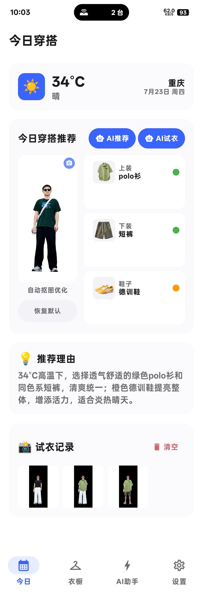
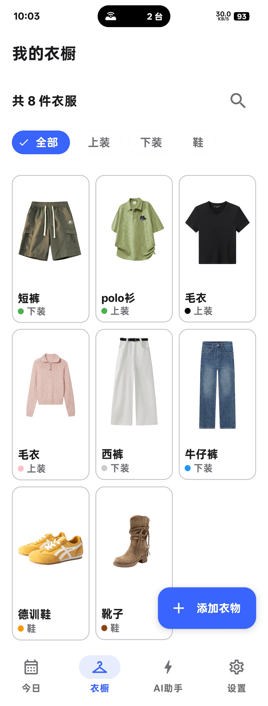
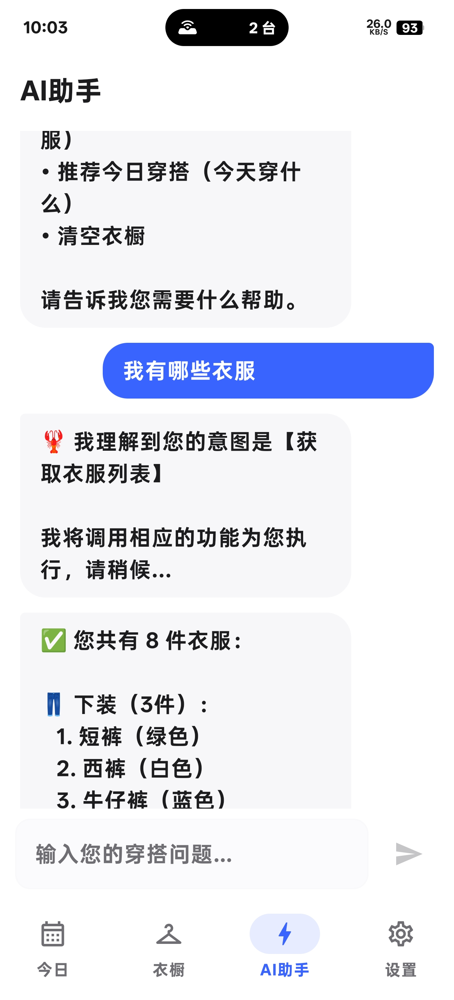

<p align="center">
  
  
  
</p>

# HsiaoWear (小不衣橱)

**HsiaoWear** 是一款免费、本地优先、注重隐私的 Android 衣橱管理应用。用户只需自行提供 API 密钥即可使用全部 AI 功能，无需注册账户。

## 特性

### 👔 衣橱管理
- 衣物的**增删改查**（上装、下装、鞋 三类）
- 按名称搜索、按分类筛选
- 图片选择 + **自动 AI 抠图**（火山引擎）

### 👗 今日穿搭推荐
- 天气信息展示（温度、城市、日期）
- **AI 穿搭推荐** — 根据衣橱内容智能搭配上装、下装、鞋
- **AI 虚拟试衣** — 上传模特图后可视化试穿效果
- 试衣历史记录，支持图片预览

### 🤖 AI 助手
- 自然语言对话式交互
- 查询衣橱数量、列出衣物、执行增删改操作
- 智能穿搭建议

### 🎨 设计风格
- 遵循 **Apple 设计规范**：统一色彩语义、8dp 栅格系统、层次化圆角
- 黑白灰蓝四色配色（**无 Material You 融合色**）
- 支持**浅色/深色主题**切换
- 支持**字体大小**调节
- **响应式布局**：手机端 BottomAppBar，平板端 NavigationRail

## 技术栈

| 层级 | 技术 |
|------|------|
| 语言 | Kotlin |
| UI | Jetpack Compose + Material 3 |
| 架构 | MVVM |
| 依赖注入 | Hilt |
| 本地存储 | Room Database |
| 网络 | Retrofit + OkHttp |
| 图片加载 | Coil |
| AI 抠图 | 火山引擎 CV API |
| AI 推荐/试衣 | 用户自配 API |

## 截图

| 今日穿搭 | 衣橱管理 | AI 助手 |
|---------|---------|---------|
|  |  |  |

## 快速开始

1. **下载 APK** — 从 Release 页面获取最新版本
2. **配置 API** — 在设置页面填入你的 API 地址和密钥
3. **添加衣物** — 点击 "+" 按钮添加你的衣物（选图后自动抠图）
4. **上传模特图** — 在今日页面点击模特图区域上传你的照片
5. **开始使用** — AI 推荐、AI 试衣、AI 助手全部可用

## 项目结构

```
app/src/main/java/com/example/hsiaowear/
├── MainActivity.kt              # 主入口 + 导航
├── ui/
│   ├── screen/
│   │   ├── TodayScreen.kt       # 今日穿搭页面
│   │   ├── WardrobeScreen.kt    # 衣橱页面
│   │   ├── LobsterScreen.kt     # AI 助手页面
│   │   ├── SettingsScreen.kt    # 设置页面
│   │   ├── AddClothingScreen.kt # 添加衣物弹窗
│   │   └── ...
│   ├── components/
│   │   └── CommonComponents.kt  # 通用组件
│   └── theme/
│       ├── Color.kt             # 色彩系统
│       ├── Theme.kt             # 主题配置
│       └── DesignSystem.kt      # 设计系统 tokens
├── data/
│   ├── local/                   # Room 数据库
│   └── repository/              # 数据仓库
├── viewmodel/                   # ViewModel
├── network/                     # API 接口
└── util/                        # 工具类
```

## 许可证

该项目为个人开发作品，仅供学习交流使用。
